# Durga Puja Donations

**A modern Flutter application for celebrating, exploring, and supporting Durga Puja events and communities.**

---

## 1. Introduction

**Durga Puja Donations** is a user-friendly mobile application designed to streamline community engagement and fundraising for Durga Puja celebrations. The app offers a seamless experience for making donations, registering as a volunteer, viewing event schedules, and staying updated with announcements—all within an elegant and intuitive interface.

**Purpose:**
- Simplify the process of discovering and supporting Durga Puja events.
- Foster community engagement and cultural celebration.
- Provide a seamless, enjoyable digital experience for users of all ages.

**Target Audience:**
- Festival attendees and devotees
- Event organizers and volunteers
- Donors and sponsors
- Anyone interested in Durga Puja celebrations

---

## 2. Installation Instructions

**Prerequisites:**
- [Flutter SDK](https://flutter.dev/docs/get-started/install)
- Git

**Step-by-Step Guide:**
1. **Clone the repository:**
   ```bash
   git clone <repository-url>
   cd durga_puja_donations-main
   ```
2. **Install dependencies:**
   ```bash
   flutter pub get
   ```
3. **Run the app:**
   ```bash
   flutter run
   ```
   *(Connect a device or start an emulator as needed)*

---

## 3. Usage

After installation, you can:

- **Make Donations**: Enter your details, select or enter a donation amount, and complete the payment using integrated UPI, card, or net banking options.
- **View Events**: Browse upcoming events, view detailed schedules, and set reminders.
- **Register as a Volunteer**: Sign up to contribute to the celebration by filling out a simple registration form.
- **Access Announcements**: Stay informed about the latest updates and important information.
- **Explore the Gallery**: Relive memories and view photos from past events.
- **Participate in Trivia**: Test your knowledge about Durga Puja and related traditions.
- **Customize Settings**: Adjust language, appearance, notifications, and security preferences.

**Tips:**
- Use the theme toggle for a personalized look.
- Tap images for a closer view.
- Use the feedback form to share your thoughts.

---

## 4. Features

- **Elegant UI/UX**: Modern, visually appealing interface with both light and dark themes.
- **Quick Donation Flow**: Effortless donation process with preset and custom amounts, and multiple payment options.
- **Event Management**: Interactive calendar and event cards for easy navigation and reminders.
- **Volunteer Registration**: Simple form to join the seva team and contribute to the community.
- **Announcements & Notifications**: Real-time updates and push notifications for important events.
- **Gallery & Memories**: Access to a curated gallery of event photos.
- **Trivia Section**: Engaging quizzes to enhance community participation.
- **Admin Portal**: Secure login for administrators to manage events and announcements.
- **Accessibility Options**: Reduced motion and language selection for a personalized experience.
- **Security Features**: Biometric and PIN login for enhanced security.

---

## 5. Design Principles & UI/UX Highlights

**Design Choices:**
- **Vibrant Festive Colors:** Inspired by Durga Puja’s traditional palette, the app uses rich reds, golds, and blues for a celebratory feel.
- **Custom Animated Backgrounds:** Subtle, flowing animations evoke the energy of the festival without distracting from content.
- **Gooey Carousel:** A unique, interactive carousel for featured content, enhancing engagement.
- **Consistent Iconography:** Simple, recognizable icons guide users intuitively.
- **Responsive Layouts:** Optimized for phones and tablets, ensuring a smooth experience on all devices.

**User Flow:**
- Minimal steps for key actions (e.g., donations, event sign-ups).
- Clear feedback after every action (e.g., donation confirmation, feedback sent).
- Logical grouping of related features for easy discovery.

**Accessibility:**
- High-contrast themes for readability.
- Large buttons and touch areas for all users.
- Support for multiple languages and right-to-left layouts.

---

## 6. Visuals

Below are visuals from the application, sourced from the project_Document/images/ folder, illustrating the core UI/UX and unique features:

| Screen                | Image                                                                 |
|-----------------------|-----------------------------------------------------------------------|
| Splash Screen         | 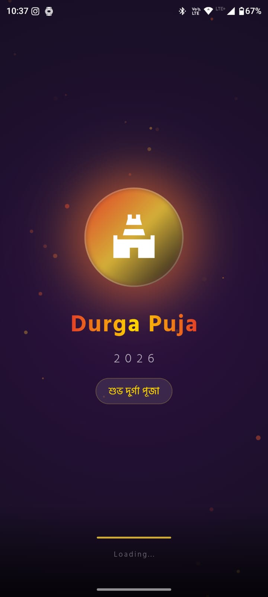           |
| Home (Festive)        | 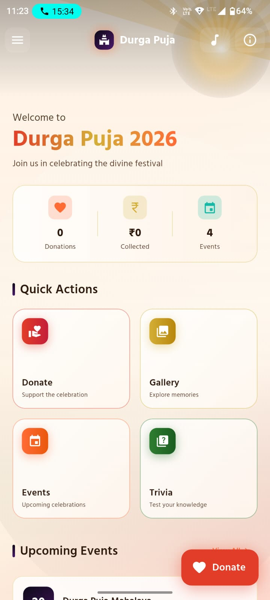             |
| Onboarding 1          | 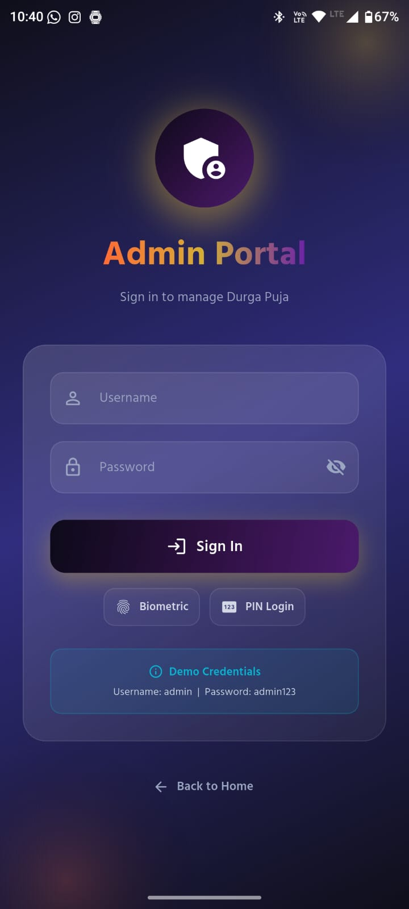             |
| Onboarding 4          | 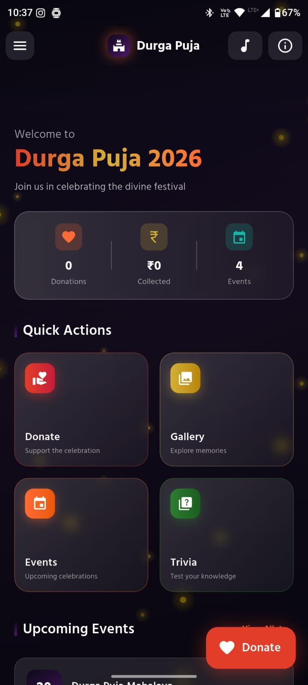             |
| Donation Step 1       | 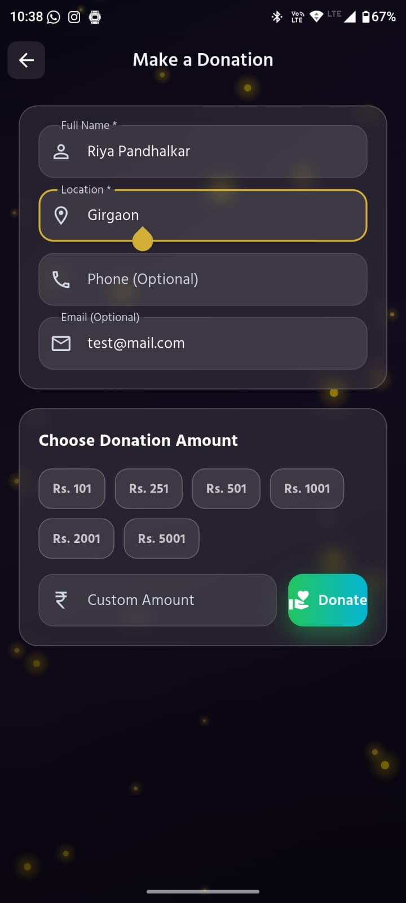          |
| Donation Step 2       | 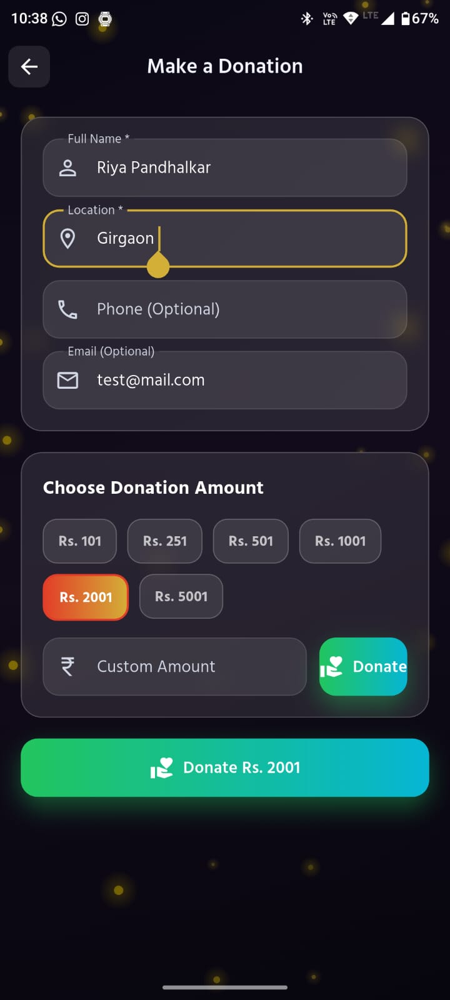          |
| Donation Step 3       | 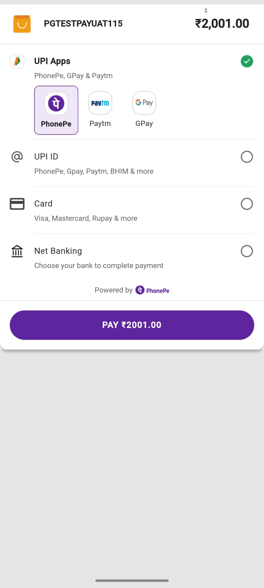          |
| Community Feed        | 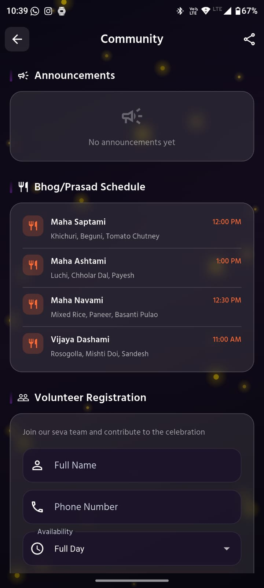         |
| Events Grid           | 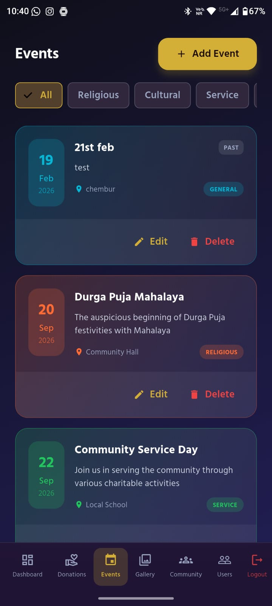               |
| Event Detail          | 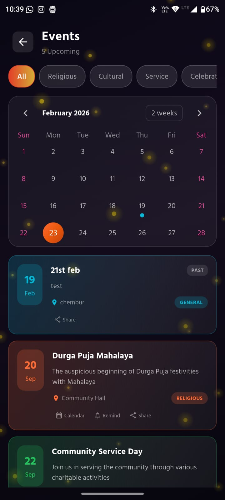             |
| Gallery Masonry       |        |
| Settings (Theme)      | 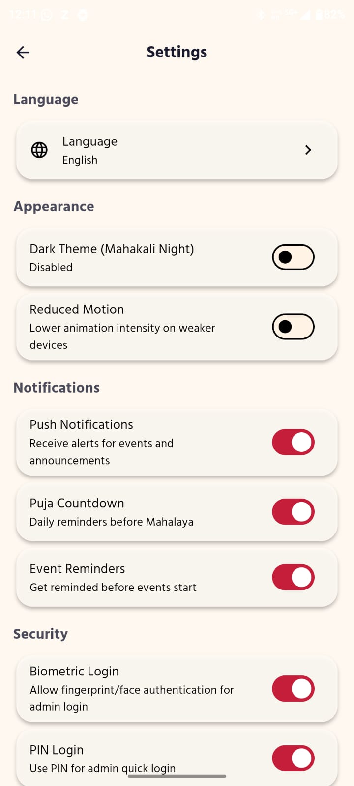          |

Each image above represents a key screen or flow in the Durga Puja Donations app, showcasing its modern design and user-centric features.

---

## 7. Get Involved

We welcome feedback and contributions! Please open an issue or pull request to help us improve the app for everyone.

---

**Enjoy a seamless, beautiful Durga Puja experience—right at your fingertips!**

For help getting started with Flutter development, view the
[online documentation](https://docs.flutter.dev), which offers tutorials,
samples, guidance on mobile development, and a full API reference.

---

## 8. Assets

The `assets` directory houses images, fonts, and any other files you want to
include with your application.

The `assets/images` directory contains [resolution-aware
images](https://flutter.dev/to/resolution-aware-images).

---

## 9. Localization

This project generates localized messages based on arb files found in


To support additional languages, please visit the tutorial on
[Internationalizing Flutter apps](https://flutter.dev/to/internationalization).

---

## 10. License

This project is intended for community use during Durga Puja celebrations. For more information, please refer to the official documentation or contact the development team.
